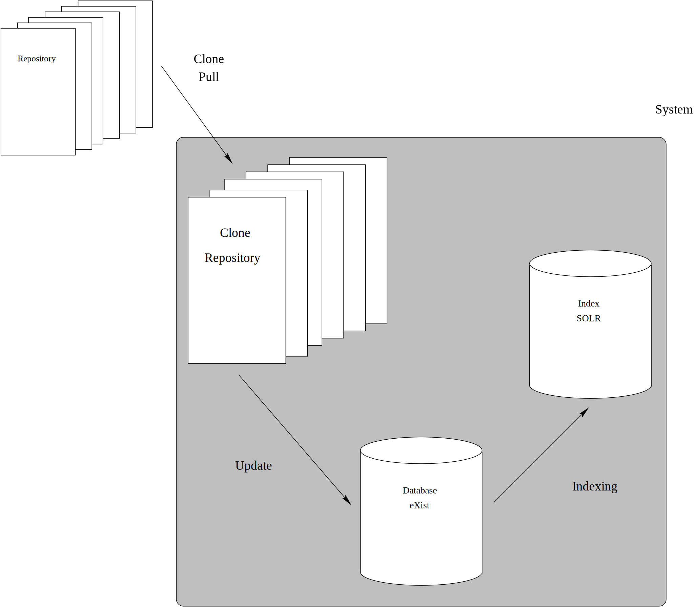

[README](REAADME.md) | Architecture

# Tools for the mirroring of repositories 

1. The term **repository** is used as a synonym for a data or software project stored in a revision control system. To begin with we limit ourselves to GIT.
2. The term **user** is referring to a library patron registrered in our user database. The **user**(s) is(are) the editor(s) responsible for the **repository**
3. The term **system** is referring to the repository-mirror system
4. A **release** is a named version (a tag) which can be manipulated using git tag commands and in particular be retrieved in a predictable condition. A branch is dynamic and change until frozen and merged with its master branch.
5. Here we refer to **commit** is including all revisions up to and including the identified commit in the given branch.

## Workflow

### 0. One or more responsible library users register as a content providers

Done using [in our user database: AD/LDAP](#3-ldap-authentication-and-authorization)

### 1. An external repository is registered by the user who must also provide credentials for the remote git repository

We do not need this, unless the repository is private

### 2. The user selects a commit or a named release to retrieve

Depending on the destination status the user needs to enter slightly different data

1. **staging** - The user may choose the HEAD or any commit in any branch

2. **production** - The user chooses a named release for publication

The two statuses store data in separate databases and only the latter is public. The staging service is a test site for the editorial users.

### 3. The system queues the clone and pull operations

Getting data from the repository according to 2 above. Running asynchronously using [ActiveMQ](#4-activemq)
Multiple jobs per repository should not be permitted. The system should ensure this is impossible.

### 4. Upon successful cloning (3 above), the system queues loading and indexing of data

1. Store in database (eXist)
2. Request indexing service for index documents
3. Store the index documents in index (Solr)

Most of this software is already written and available in [Solr and Snippets](https://github.com/Det-Kongelige-Bibliotek/solr-and-snippets)

Some kind of pipeline implemented using [ActiveMQ](#4-activemq)

### 5. If failure in 3 above, messages should be passed to those who can do something about it

Task should be stored somewhere for re-execution

### 6. Upon successful loading in 4. above, the data become directly available in the environment selected in 2 above.

### 7. If failure, go to 5.

## Ideas

### 1. Git Large File Storage (LFS)

"Git Large File Storage (LFS) replaces large files such as audio
samples, videos, datasets, and graphics with text pointers inside Git,
while storing the file contents on a remote server like GitHub.com or
GitHub Enterprise" Sounds promising :^)

https://git-lfs.github.com/

Imagine correlated correlated or transcribed text and images, videos or sounds. A
system-dependent way of maintaining links and redirection of local
ones to a remote server.

### 2. Duplicating/mirroring repository

A true mirror (if we are synchronising without pushing things to the origin, I believe). Not sure that helps

https://help.github.com/articles/duplicating-a-repository/

### 3. LDAP authentication and authorization

Should be easy to add an external contributor through Active Directory

https://httpd.apache.org/docs/2.4/mod/mod_authnz_ldap.html

That should relieve us from user management

### 4. activemq

http://activemq.apache.org/
